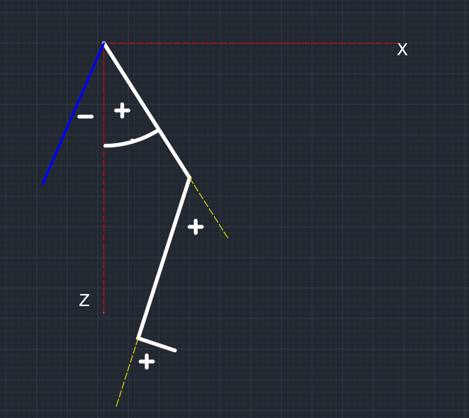

# Motion capture

这是一个利用双目视觉方法进行下肢运动捕捉的项目。

## 一、 使用方法

### 依赖

    - OpenCV（只在4.x版本测试过）
    - Matlab(需要stereo calibration 工具箱)
    - Spinnaker SDK（这是相机的SDK）
    - TwinCat （这是Ads通讯的依赖，可选）

### 生成

推荐使用CMake 构建项目

你需要根据安装Spinnaker的位置对CMakeLists.txt做一定的修改，才能配置成功

###   MotionCapture

    对标记点进行跟踪并输出经过低通滤波的步态角度
    其工作流程如下：
    - 自动生成相机标定矩阵，等待数十帧以保证白平衡完成（否则颜色会出现错误，导致识别标记点错误）
    - 尝试从build目录下的FrameDefine.yml获取相机坐标系到世界坐标系的转换矩阵，如果失败则转为从场景中的标定板自动生成转换矩阵并将之存放到FrameDefine.yml中
    - 为四个相机依次弹出detectwindow窗口（黑白），用户需要从窗口中选取标记点所在区域（以排除区域外的干扰），弹出窗口依次为左上、左下、右上、右下（从机器人面向相机支架来看）的相机。选取完成后，自动定位各个标记点并展开追踪。
    - 开始连续输出经过低通滤波的角度信息。这是一个长度为6的double 类型数组，依次为左髋、左膝、左踝、右髋、右膝、右踝的关节角（以度为单位）。

## 二、项目的实现

各文件夹的内容：

    src // 源文件所在文件夹
    include // 头文件所在文件夹
    lib // 静态链接库文件（TWinCat）
[matlab脚本](save_camera_calib_to_yml.m)的作用是将matlab双目标定工具箱生成的标定结果转换为OpenCV可读的yaml格式，即[calib_params.yml](calib_params.yml)。

### 一些定义方式

    - 相机序号：以左上、左下、右上、右下（从机器人面向相机支架来看）分别为0，1，2，3号相机。
    - 跟踪算法是跟踪一对标记点（大腿、小腿、足）而非每个标记点都创建跟踪器

## 三、世界坐标系的变换
流程如下：

    - 获取棋盘格中三个点的空间位置（相机坐标系），以其中一点为原点，获得其他两点在此坐标系下的坐标p0, p1
    - 由p1, p0的叉乘得到p2，这个向量便是垂直于棋盘的向量（设为X轴），p0设为Y轴
    - 由p2， p0的叉乘得到X轴。
    - 即Z轴由原点指向地面（实际上是标定板中原点下方的那个点），X轴由原点指向跑步机前进方向，y轴由原点指向右腿。
    - 矩阵[X, Y, Z]便是由是世界坐标系到相机坐标系的旋转矩阵，设为R
    - 原点在相机坐标系中的位置便是世界坐标系到相机坐标系的位移向量, 设为T
    - 所以R.inv是相机坐标系到世界坐标系的旋转矩阵，由于旋转矩阵都是正交矩阵，所以R.inv == R.Transpose
    - 而-T便是相机坐标系到世界坐标系的位移向量
    - 故 P_world = R.inv*(P_camera-T) (矩阵乘法)

## 四、步态角的定义

步态角，由上往下标号递增。正负如图所示

## 五、双目相机的标定
左腿和右腿的运动各有一对相机进行获取。
标定这些相机需要以下步骤

    - 收集相机对的同步采集的照片，可以通过项目RetriveImagePairs完成
    - 通过matlab中的stereo calibration工具箱标定双目相机
    - 保存左右两对双目相机的参数到两个不同的.mat文件
    - 通过save_camera_calib_to_yml.m 文件，将.mat文件转为opencv可以读取的.yml文件（即calib_params.yml，注意此文件包括了两对双目相机的参数）

## TODO

    - 整体速度取决于三个部分：1. 处理的速度； 2. 获取图像的速度（同步帧率）3. 前两者之间的同步问题
	- 移除不必要的Try catch 语句， 避免程序在出现严重错误时仍然运行 
    - FindWorldFrame函数很丑陋，需要优化
